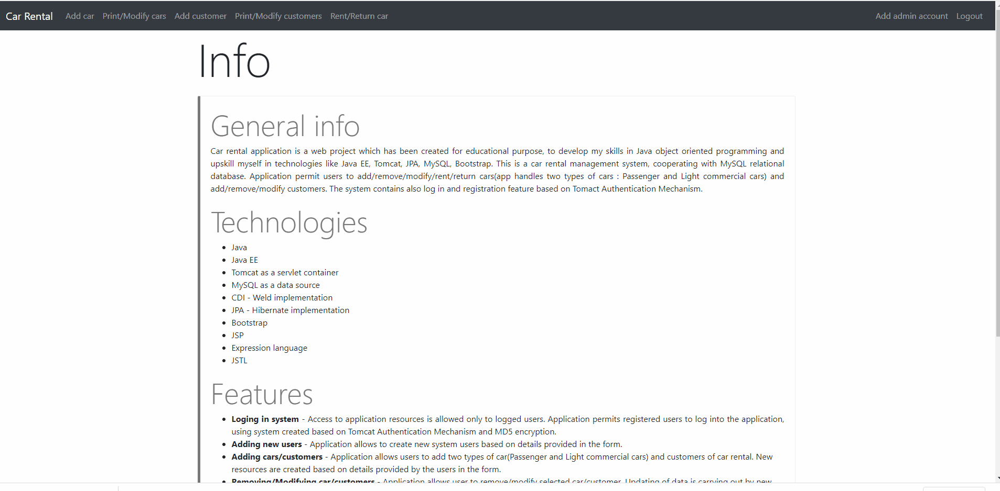

# Car rental web application 
Car rental management system written using Java/Jave EE technolgies.

## Table of contents
* [General info](#general-info)
* [Technologies](#technologies)
* [Features](#features)
* [Contact](#contact)

## General info
Car rental application is a web project which has been created for education purpose, to develop my skills in Java object oriented programming and upskill myself in technologies like Java EE, Tomcat, JPA, MySQL, Bootstrap. This is a car rental  management system, cooperating with MySQL relational database. Application permit users to add/remove/modify/rent/return cars(app handles two types of cars : Passenger and Light commercial cars) and add/remove/modify customers. The system contains also log in and registration feature based on Tomact Authentication Mechanism. 

## Technologies
* Java
* Java EE
* Tomcat as a servlet container
* MySQL as a data source
* CDI - Weld implementation
* JPA - Hibernate implementation
* Bootstrap
* JSP
* Expression language 
* JSTL

## Features
* **Loging in system** - Access to application resources is allowed to only to logged users. Application permits registered users to log into the application using system created based on Tomcat Authentication Mechanism.
* **Adding new users** - Application allows to create new system users based on details provided in the form.
* **Adding cars/customers** - Application allows users to add two types of car(Passenger and Light commercial cars) and customers of car rental. New resources are created based on details provided by the users in the form. 

Adding car

                                                            
  
  
* **Removing/Modyfing car/customers** - Application allows user to remove/modify selected car/customer. Updating of data is carrying out by new details provided in the form.
* **Printing cars and users** - Application allows users to print collection of cars and customers existed in system. To make viewing data comfortable, it has been implemented pagination system.
* **Renting/Returning Cars** - Application allows to rent a car for period selected by the user. Once car is rented it cannot be rented by other customer, until the car has been returned. After returning state of car changes to available.

## Contact
Created by : Martin Skuthan. Please feel free to contact me :
* My mail: martin.skuthan95@gmail.com
* Linkedin : www.linkedin.com/in/martin-skuthan-630553190
